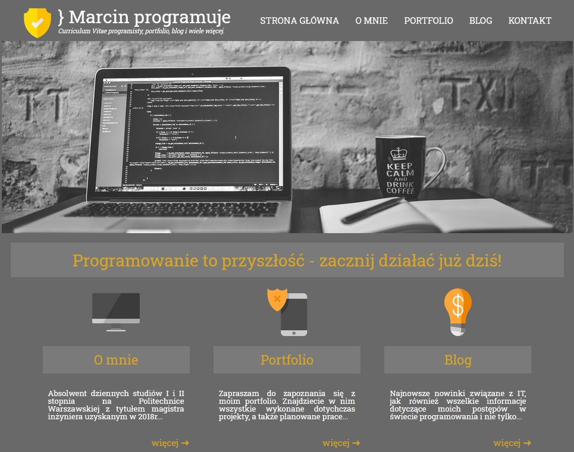
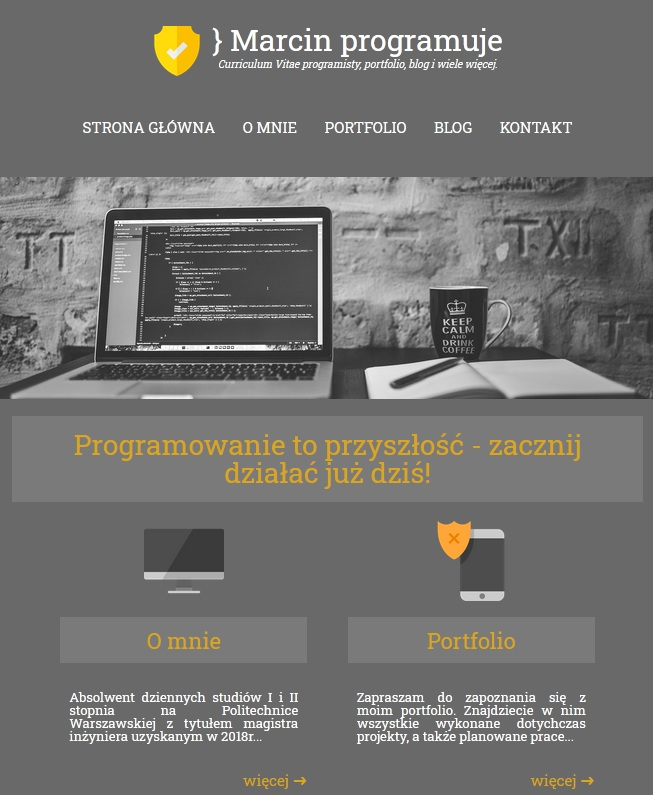
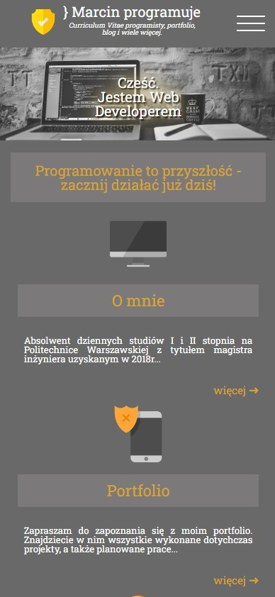

## Table of contents
* [General info](#general-info)
* [Technologies](#technologies)
* [Screenshot PC version](#screenshot-pc-version)
* [Screenshot tablet version](#screenshot-tablet-version)
* [Screenshot smartfon version](#screenshot-smartfon-version)
* [Author](#author)
* [Other info](#other-info)

## General info
My first own page based on `HTML5`, `CSS3`, `JavaScript` including `Responsive Web Design`.
You can find here information about me (my skills, my education), about my projects and if you want you can contact me entering the tab "Kontakt".
Also you can find there my blog where I put the progress of my learning and work.

**Subpage in PL** | **Subpage in EN** | **Some info**
--- | --- | ---
*Strona główna* | Home page | Just home page
*O mnie* | About me | Hmm... it's just info about me
*Portfolio* | Portfolio | There you can find my projects and my workspace
*Blog* | Blog | Some information about my progress in the IT world
*Kontakt* | Contact | There you can find my social media pages (*instagram, facebook, linkedin, github*) and *e-mail* if you want to contact me
	
## Technologies
Project was created with:
* HTML5
* CSS3
* JavaScript
* RWD & MQ

## Screenshot PC version

## Screenshot tablet version

## Screenshot smartfon version

## Author
Copyright © Marcin Godlewski

## Other info
Free icons (used on this webpage) were designed by Freepik https://www.flaticon.com/authors/freepik and RoundIcons https://www.flaticon.com/authors/roundicons from www.flaticon.com -> `grafika-png` folder.
Other pictures comes from free site Pexels https://www.pexels.com/ -> `grafika-jpg` folder.
